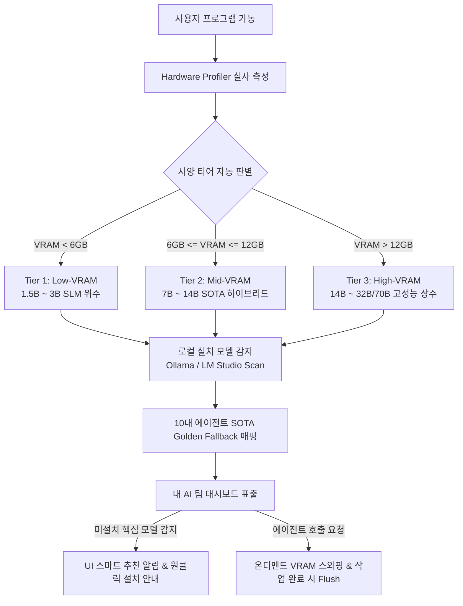

# 📄 [PRD] 하드웨어 적응형 100점 만점 SOTA AI 팀 오케스트레이션 엔진

---

## 1. 프로젝트 개요 (Executive Summary)
- **프로젝트 명**: 하드웨어 적응형 100점 만점 SOTA AI 팀 오케스트레이션 엔진 (Hardware-Adaptive 100-Point SOTA Multi-Agent Engine)
- **목적**: 사용자의 PC 사양(VRAM, RAM, CPU)을 실시간 자동 진단하여, 상용 서비스가 완벽히 가능한 오픈소스 정품(Apache 2.0 / MIT) SOTA 모델을 10대 에이전트에게 지능형으로 1:1 자동 배정하고, 부족한 모델의 원클릭 설치 가이드를 제공하는 자율 최적화 시스템 구축.
- **핵심 가치**:
  1. **Zero-Configuration 적응성**: 하드웨어 사양을 1초 만에 감지하여 Low/Mid/High VRAM 티어별 최적 모델 자동 세팅.
  2. **100점 만점 상용화 신뢰성 (Commercial Reliability)**: 출처 불분명한 커뮤니티 머지 모델을 배제하고 글로벌 벤치마크 1위 공식 정품 모델만 매핑.
  3. **VRAM 6GB 극복 하네스 (Smart Swapping)**: `keep_alive: 5m` 및 모델 전환 시 `flush_vram()`으로 OOM(Out of Memory) 원천 차단.

---

## 2. 시스템 아키텍처 및 데이터 흐름 (Architecture Flow)

---

## 3. 기능 요구사항 명세 (Functional Requirements)

### 3.1. [FR-1] 하드웨어 사양 자동 프로파일링 & 티어링
- `nvidia-smi` 및 PyTorch fallback을 통해 VRAM 및 시스템 RAM 정밀 측정.
- **Low-VRAM (< 6GB)**: 경량 SLM(`llama3.2:3b`, `qwen2.5:3b`) 위주 배정.
- **Mid-VRAM (6GB~12GB, 현 사양)**: GPU 6GB + RAM 32GB 분산 하이브리드(`qwen2.5-coder:14b`, `deepseek-r1:14b/8b`, `qwen2.5vl:7b`).
- **High-VRAM (> 12GB)**: 32B/70B 대형 모델 풀 GPU 상주.

### 3.2. [FR-2] 10대 에이전트 100점 만점 SOTA 다계층 폴백(Fallback) 매핑
로컬에 설치된 모델 중 최상의 모델을 지능적으로 찾아 매핑하며, 상용 라이선스(Apache 2.0, MIT, Llama) 모델을 1순위로 배치합니다.

| 에이전트 | 역할 | 100점 만점 우선순위 탐색 체인 (Fallback Chain) | 기본 라이선스 |
| :--- | :--- | :--- | :--- |
| **@ceo** | 기획 총괄 | `deepseek-r1:14b` ➡️ `deepseek-r1:8b` ➡️ `deepseek-r1:7b` ➡️ `qwen2.5:14b` ➡️ `qwen2.5:7b` | MIT / Apache 2.0 |
| **@developer** | 수석 엔지니어 | `qwen2.5-coder:14b` ➡️ `qwen2.5-coder:7b` ➡️ `qwen2.5-coder` | Apache 2.0 |
| **@designer** | 리드 디자이너 | `qwen2.5vl:7b` ➡️ `qwen2.5-coder:7b` ➡️ `qwen2.5:7b` | Apache 2.0 |
| **@researcher**| 트렌드 리서처 | `deepseek-r1:14b` ➡️ `deepseek-r1:8b` ➡️ `deepseek-r1:7b` ➡️ `qwen2.5:14b` ➡️ `qwen2.5:7b` | MIT / Apache 2.0 |
| **@business** | 비즈니스/BM | `qwen2.5:14b` ➡️ `deepseek-r1:14b` ➡️ `deepseek-r1:8b` ➡️ `qwen2.5:7b` | Apache 2.0 / MIT |
| **@writer** | 카피라이터 | `qwen2.5:7b` ➡️ `mistral-nemo` ➡️ `llama3:8b` | Apache 2.0 |
| **@youtube** | 유튜브 디렉터 | `qwen2.5:7b` ➡️ `mistral-nemo` ➡️ `llama3:8b` | Apache 2.0 |
| **@editor** | 사운드/편집 | `mistral-nemo` ➡️ `qwen2.5:7b` ➡️ `gemma2:9b` | Apache 2.0 |
| **@instagram** | 인스타 마케터 | `llama3.2:3b` ➡️ `qwen2.5:3b` ➡️ `qwen2.5:7b` | Llama 3.2 / Apache |
| **@secretary** | 개인 비서 | `llama3.2:3b` ➡️ `qwen2.5:3b` ➡️ `qwen2.5:7b` | Llama 3.2 / Apache |

### 3.3. [FR-3] VRAM 6GB 스마트 온디맨드 스와핑 & 하네스 수명주기
- **Keep-Alive 5분 캐싱**: 동일 에이전트와의 연속 대화 시 모델 재로딩 딜레이(2~3초) 없이 즉답 제공.
- **작업 전환 플러시**: 다른 대형 에이전트 호출 시 또는 메모리 한계 임박 시 `hardware_profiler.flush_vram()`을 트리거하여 CUDA 캐시 및 가비지 즉시 정리.

### 3.4. [FR-4] UI 대시보드 추천 가이드 및 원클릭 복사
- 클라이언트 `MyTeamModal` / `ModelManager`에 현재 하드웨어 티어 상태 표시.
- 미설치된 최고 추천 모델이 있을 경우 다운로드 명령어(`ollama pull <model>`)를 원클릭 복사할 수 있는 가이드 배너 제공.

---

## 4. 검증 및 합격 기준 (Verification Criteria)
1. **단위 테스트 통과**: `pytest server/tests/test_hardware_profiler.py` 100% 통과.
2. **실제 모델 매핑 확인**: 로컬 모델 감지 시 `qwen2.5-coder:14b`, `qwen2.5:7b`, `llama3.2:3b` 등이 10대 에이전트에 오차 없이 정상 배정되는지 API 응답 검증.
3. **VRAM 플러시 검증**: `flush_vram()` 호출 후 CUDA 캐시 해제 상태 코드 검증.

---

## 5. 결재 및 이력 관리 (Sign-off History)
- **작성자**: 코다리 개발부장 (@developer)
- **승인자**: 대표님 (@ceo)
- **상태**: Draft ➡️ 결재 대기 (Reviewing)
