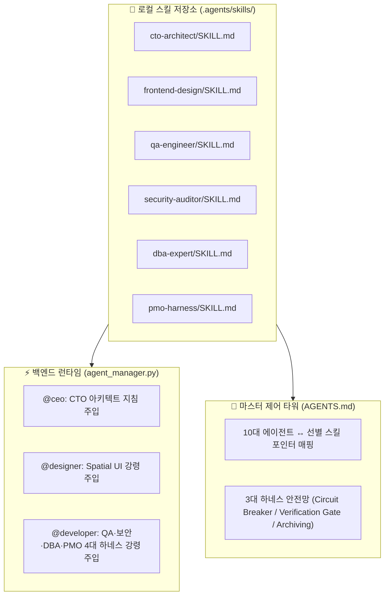

# 📑 PRD: 10대 에이전트 군단 & 코다리 딥테크 선별 시너지 하네스 통합 시스템
**Document Version:** `v1.0`  
**Date:** `2026-08-18`  
**Author:** 코다리 개발부장 (`@developer`)  
**Approval Status:** `[🟡 검토 대기]`  

---

## 📋 최상단 변경 및 결재 이력 (Revision Log)

| 버전 (Ver.) | 기록 일시 (DateTime) | 작성자 (Author) | 결재 상태 (Status) | 핵심 지시 및 변경 내용 (Key Directives) |
| :--- | :--- | :--- | :--- | :--- |
| **v1.0** | 2026-08-18 20:06 | 코다리 부장 | 🟡 검토 대기 | 10대 에이전트 및 코다리 개별 군단 선별 시너지 스킬셋 주입 및 3대 하네스 전면 가동 PRD 초안 작성 |

---

## 1. 프로젝트 개요 (Executive Summary)
본 프로젝트는 기존 `next11`의 10대 에이전트 오케스트레이션 시스템에 전역(Global) 코다리 개별 군단의 핵심 딥테크 엔지니어링 및 PMO 거버넌스 스킬을 **'선별적 하이브리드 모듈형 연계'** 방식으로 주입하여, **토큰 낭비 0%를 유지하면서도 시스템 무결성, 보안, DB 최적화, 2026 Spatial UI 디자인 역량을 엔터프라이즈급으로 극대화**하는 것을 목표로 합니다.

---

## 2. 해결하고자 하는 문제 (Problem Statement)
1. **개발/인프라 영역의 사각지대**: 기존 10대 에이전트 체계에서 `@developer(코다리)` 1명에게 모든 엔지니어링이 집중되어 있어 보안 감사, DB 튜닝, TDD 엄격성, 엣지 런타임 지침이 구체화되지 못함.
2. **무차별 프롬프트 주입 시 부작용**: 개별 군단 전체(20개 이상의 스킬)를 무차별 주입할 경우 토큰 비용 급증, 응답 속도 저하, 크리에이티브 에이전트(레오, 찬우 등)의 페르소나 희석 문제 발생.
3. **자산 보존 및 거버넌스 부재**: 작업 중 기획서 덮어쓰기나 연속 에러 발생 시의 자동 복구/서킷 브레이커 안전망이 느슨함.

---

## 3. 핵심 목표 및 성공 지표 (Objectives & KPIs)

### 🎯 핵심 목표
* **토큰 오버헤드 0% 달성**: 필요한 핵심 지침과 스킬 트리거 포인터만 시스템 프롬프트에 주입하여 컨텍스트 비대화 방지.
* **딥테크 4대 영역 결함 0%화**: TDD(QA), 보안(Security), DB 최적화, 거버넌스(PMO) 규칙 강제.
* **2026 Spatial UI 비주얼 격상**: 디자이너 민희에게 2026 Spatial Depth 및 Agentic UX 설계 역량 장착.
* **마케팅 페르소나 100% 무결점 보존**: 유튜브/인스타/카피라이터의 트렌디한 톤앤매너에 엔지니어링 간섭 0%.

### 📊 성공 지표 (KPIs)
* 백엔드 에이전트 시스템 프롬프트 생성 및 단위 테스트 통과율 **100%**.
* 에러 3회 연속 실패 시 **Circuit Breaker** 발동 및 즉각 대안 제시.
* 모든 코드 수정 시 **Verification Gate** 증적 로그 의무화.

---

## 4. 선별 시너지 스킬 매핑 명세 (Target Skillset Mapping)

| 대상 에이전트 | 기존 역할 | 선별 주입 스킬 | 강화되는 핵심 역량 |
| :--- | :--- | :--- | :--- |
| **🧭 @ceo** | Chief Executive | `cto-architect` | 거시적 시스템 아키텍처 수립, 모듈 분할, 기술 타당성 사전 검토 |
| **🎨 @designer (민희)** | Lead Designer | `frontend-design` | 2026 Spatial UI (Z-Axis 공간감, 햅틱 텍스처, 다크모드 HSL, Agentic UX) |
| **💻 @developer (코다리)** | Senior Full-Stack | `qa-engineer` `security-auditor` `dba-expert` `pmo-harness` | TDD 기반 무결성 테스트, 하드코딩 시크릿/인젝션 차단, DB/인덱스 튜닝, 3회 서킷브레이커 |
| **📺 레오 / 📷 찬우 / ✍️ 지은 / 🎵 루나 / 💼 현빈 / 🔍 정우 / 📱 영숙** | 마케팅·크리에이티브·전략 | *순수 페르소나 유지* | 엔지니어링 간섭 없이 후킹, 숏폼, 세일즈 카피, BGM 무드, BM 분석 본연의 감각 100% 보존 |

---

## 5. 시스템 아키텍처 및 주입 방식 (Hybrid Module Architecture)

1. **로컬 스킬 파일 동기화**: `C:\Users\PC\.gemini\config\skills\`의 선별 스킬들을 본 프로젝트의 `e:\진짜배기\next11\.agents\skills\`로 복사 배치하여 독립적이고 영구적인 이식성 확보.
2. **백엔드 프롬프트 경량화 동기화**: `server/services/agent_manager.py`의 `DEFAULT_AGENTS` 및 `build_system_prompt`에 각 에이전트별 '3대 핵심 행동 강령(Directives)'을 주입.
3. **마스터 인덱스 갱신**: `AGENTS.md` 및 `CLAUDE.md`에 선별 스킬 포인터 및 3대 하네스 거버넌스 규칙 명시.

---

## 6. 3대 글로벌 하네스 거버넌스 프로토콜 (Mandatory Safety Gates)

1. **Circuit Breaker (MAX 3)**
   * 동일한 에러나 버그 수정이 3회 연속 실패할 경우, 무한 루프를 차단하고 즉각 작업을 중단한 뒤 대표님께 원인 분석과 대안을 보고한다.
2. **Verification Gate (TDD / Lint / Test)**
   * 모든 코드 변경은 `pytest` 또는 `verify.py`를 실행하여 실제 테스트 통과 증적(Test Logs)을 확인한 후에만 완료 처리한다.
3. **Chronological Archiving & Revision Log**
   * 계획서(`implementation_plan.md`) 및 주요 기획 문서는 절대로 기존 내용을 덮어써서 유실시키지 않으며, 변경 시 타임스탬프 백업(`archive/`) 및 최상단 결재 이력 테이블을 누적 갱신한다.

---

## 7. 검증 및 롤아웃 계획 (Verification & Rollout)
* **1단계 (파일 동기화)**: 선별 스킬 디렉토리를 `.agents/skills/`에 복사 및 구조 정렬.
* **2단계 (코드 수정)**: `server/services/agent_manager.py`, `AGENTS.md`, `CLAUDE.md` 정밀 타격 수정.
* **3단계 (단위 테스트 검증)**: `pytest server/tests/` 실행하여 에이전트 프롬프트 생성 및 라우팅이 정상 통과하는지 검증.
* **4단계 (최종 승인 보고)**: 대표님께 Walkthrough 및 실사 증적 제출.
